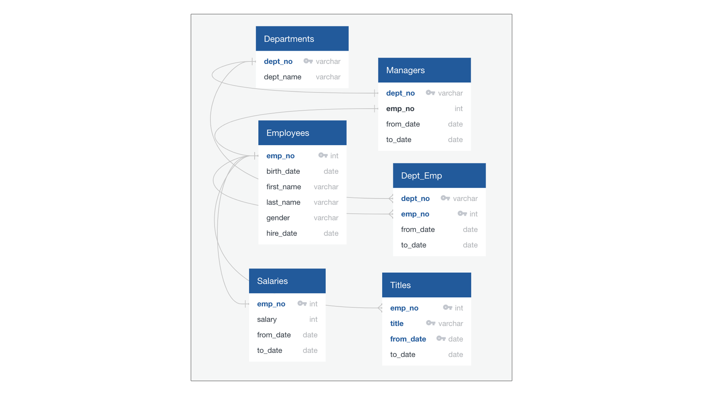

# Pewlett-Hackard-Analysis

## Overview of Analysis

1.) Determine the number of retiring employees per title to better understand the volume of upcoming retirees.

2.) Identify those upcoming retirees who are eligible to participate in a part time mentorship program with newly hired employees. 

## Results

Our databasebase structure is illustrated through this entity relationship diagram:

#### 1.) The Number of Retiring Employees By Title 
 

- There are 2x more senior employees that are approaching retirement compared to non senior staff members.
- Seniority is more significant than function role when considering retirement readiness. 

#### 2.) Upcoming Retirees Eligible to Participate in Part-time Mentorship Program 

- There are approximately 1500 employees who are retiring soon and eligible for the part time mentorship program.
- That is approximately 1% of the total number of employees who are retiring soon

### Summary

-  The "Silver Tsunami" has the potential of being 150,000 employees strong. Hiring at least half of that over the next 2-3 years would prevent catasrophe. 
-  There are rougly 1% of the silver tsunami available to mentor the new hiring wave.  That is unlikely to be enough to make a significant impact. 
